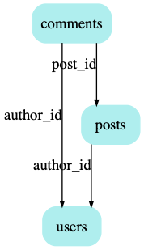

# SchemaViz

Tool to visualize tables and foreign keys with Graphviz.

## Installation

```
go get github.com/vilterp/schemaviz
```

## Usage

Given this in DB `blog`:

```sql
CREATE TABLE users (
  id INT PRIMARY KEY,
  email text
);

CREATE TABLE posts (
  id    INT PRIMARY KEY,
  author_id INT REFERENCES users,
  title text,
  body  text
);

CREATE TABLE comments (
  id INT PRIMARY KEY,
  post_id INT REFERENCES posts,
  author_id INT REFERENCES users,
  body text
);

```

invoke:

```
schemaviz postgres://user@host/db | dot -Tpng -o example.png
```

and you'll get:


